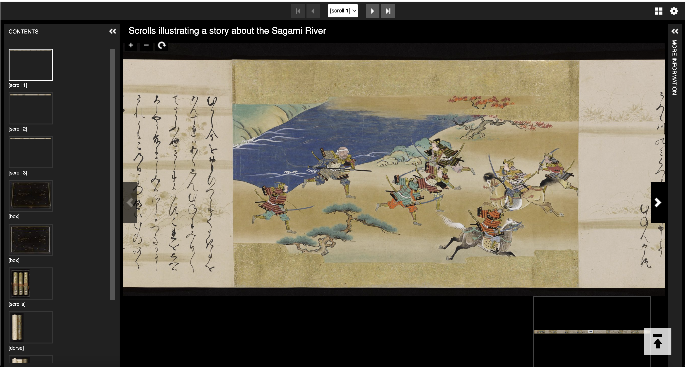
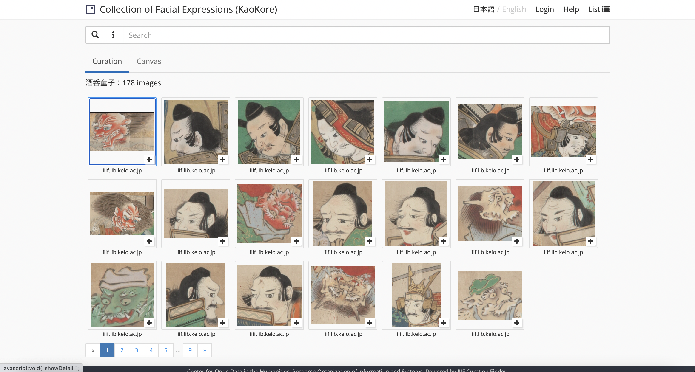
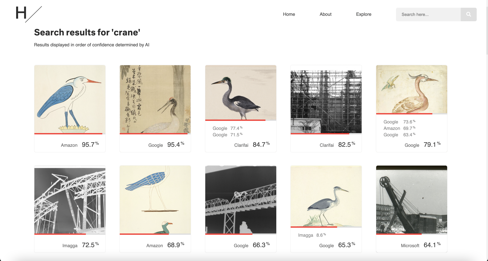

# Usages et démos

Quelques exemples d'utilisation de l'API Image :

<figure markdown>
  
  <figcaption>Simple intégration d'une image ou portion d'image dans une page web (possibilité d'utiliser l'élément HTML "picture" et des URL IIIF pour rendre l'image responsive</figcaption>
</figure>

<figure markdown>
  
  <figcaption><a href="https://catalog.princeton.edu/catalog/9981720703506421#view">Scrolls illustrating a story about the Sagami River</a> (Princeton University Library)</figcaption>
</figure>

<figure markdown>
  
  <figcaption><a href="http://codh.rois.ac.jp/face/iiif-curation-finder/?curation=https://mp.ex.nii.ac.jp/api/face/curation/json/be595b9a-7191-4eda-bb98-c04d4a2c50f3&lang=en#">Collection of Facial Expressions (KaoKore)</a> (IIIF Curation Platform, Center for Open Data in the Humanities)</a></figcaption>
</figure>

<figure markdown>
  
  <figcaption><a href="https://ai.harvardartmuseums.org/search/crane">Harvard AI Explorer</a></figcaption>
</figure>

<figure markdown>
  
  <figcaption><a href="https://ai.harvardartmuseums.org/search/crane">National Neighbours</a> (NGA, Washington)</a></figcaption>
</figure>

<figure markdown>
  
  <figcaption><a href="https://observablehq.com/@bertspaan/allmaps-tile-server?url=https://tile.loc.gov/image-services/iiif/service:gmd:gmd5:g5834:g5834p:ct003571/info.json">Allmaps Tile Server</a> (Bert Spaan)</a></figcaption>
</figure>
