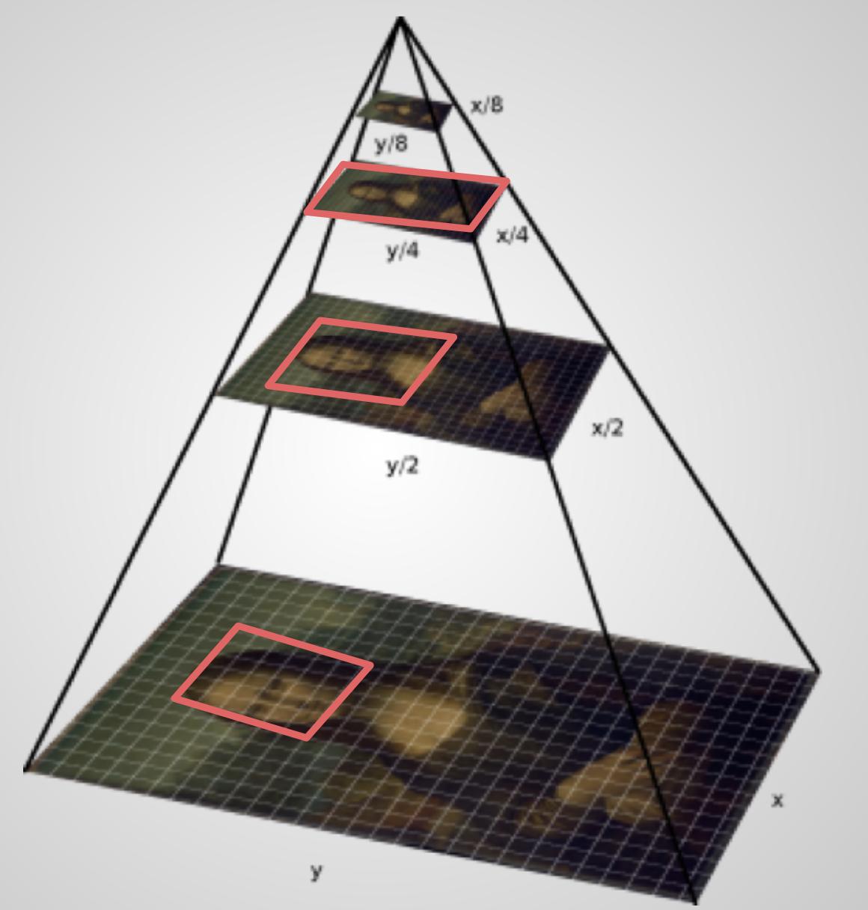

# Implémentation

## Formats d'image source

**Les API IIIF sont agnostiques en termes de formats d'image source**, ce afin d'éviter au maximum la dépendance à des technologies spécifiques (par exemple JPEG2000). La plupart des serveurs d'images supportent en entrée les formats les plus courants tels que JPEG, PNG ou TIFF.

Cependant, pour les images en haute résolution, il est conseillé d'opter pour un **format d'image optimisé pour le zoom profond et progressif**, supportant le principe de tuilage : **JPEG2000** ou **TIFF Pyramidal**.

La raison à cela peut être illustrée par l'image suivante :



Explications :

Lorsqu'on zoome au sein d'une image le visualiseur affiche uniquement les tuiles nécessaires, selon la zone et le niveau de zoom choisi par l'utilisateur. Le visualiseur ne télécharge jamais l'image en entier d'un seul coup. Les formats JPEG2000 et TIFF Pyramidal encapsulent toutes ces tuiles d'images et niveaux de résolution dans un seul fichier. Ainsi un serveur d'images a juste besoin de lire et extraire les tuiles adéquates au fur et à mesure. Cela rend la consultation plus fluide et performante pour l'internaute.

!!! example "Exemple"

    Observer le principe de tuilage dans le _[IIIF Tile Exploder](http://tomcrane.github.io/presentations/tile-exploder.html)_ (coller une URL info.json).

Autres avantages de ces deux formats :

- ils offrent des possibilités intéressantes en termes de compression (avec ou sans perte), en particulier le JPEG2000. Cela peut représenter un gain substantiel en espace de stockage. 
- ils permettent des gains de performance au niveau des serveurs d'image : en effet ces logiciels peuvent accéder plus efficacement aux données contenues dans le fichier image, les décoder et les délivrer rapidement.

Pour toutes ces raisons, les formats JPEG2000 et TIFF Pyramidal sont les plus répandus au sein de la communauté IIIF.


### Génération de JPEG2000 ou TIFF Pyramidal

Il y a plusieurs outils et recettes pour créer des fichiers JPEG2000 et TIFF Pyramidal.

#### Pour JPEG2000

Quelques librairies :

- [Kakadu](https://kakadusoftware.com) (propriétaire)
- [OpenJPEG](https://www.openjpeg.org) (libre)
- [Grok](https://github.com/GrokImageCompression/grok) (libre)
- [ImageMagick](https://imagemagick.org) (via OpenJPEG)

Exemples de recettes :

``` title="OpenJPEG Lossless"
$ opj_compress -i [input_file] -o [output_file] -r 1 -n 7 -c [256,256],[256,256],[256,256],[256,256],[256,256],[256,256],[256,256],[128,128] -t 512,512 -p RPCL -b 64,64 -SOP -EPH -TP R -PLT
```

``` title="OpenJPEG Lossy"
$ opj_compress -i [input_file] -o [output_file] -r 8 -n 7 -c [256,256],[256,256],[256,256],[256,256],[256,256],[256,256],[256,256],[128,128] -t 512,512 -p RPCL -b 64,64 -SOP -EPH -TP R -PLT
```

#### Pour TIFF Pyramidal

Quelques librairies :

- [Libvips](https://www.libvips.org) (libre)
- [libtiff](https://gitlab.com/libtiff/libtiff)
- [ImageMagick](https://imagemagick.org)

Exemples de recettes :

``` title="Libvips"
$ vips tiffsave [input_file] [output_file.tif] --compression deflate --tile --pyramid --tile-width 256 --tile-height 256
```

``` title="ImageMagick"
$ convert [input_file] -define tiff:tile-geometry=256x256 -compress jpeg -quality 90 'ptif:[output_file.tif]'
```

Voir aussi :

- [Bodleian JPEG2000 Profile](https://image-processing.readthedocs.io/en/latest/jp2_profile.html) (Kakadu)
- [serverless-iiif - Creating tiled TIFFs](https://github.com/samvera/serverless-iiif#creating-tiled-tiffs)


## Types d'implémentation

Il existe deux principaux types d'implémentation de l'API Image :

### Dynamique

Une implémentation dynamique passe par l'installation et le paramétrage d'un serveur d'images IIIF (voir une [liste de logiciels existants](https://github.com/IIIF/awesome-iiif/#image-servers)). Cela permet de bénéficier des principales fonctionnalités de l'API Image (level 1 ou 2 : voir l'annexe _[Image API Compliance](https://iiif.io/api/image/2.1/compliance/)_).

Parmi les serveurs d'images IIIF les plus répandus dans la communauté, on peut citer :

- [IIPImage](http://iipimage.sourceforge.net) (C++)
- [Cantaloupe](https://cantaloupe-project.github.io) (Java)

Une alternative pour bénéficier de l'API Image est de recourir à une plateforme dédiée et proposée à titre gratuit ou payant par une institution ou un prestataire de services. Citons par exemple :

- [Internet Archive](https://archive.org)
- [IIIF Hosting](https://www.iiifhosting.com) (Klokan technologies GmbH)
- [DLCS](https://dlcs.info) (Digirati)
- [Nakala](https://www.nakala.fr) (IR* Huma-Num, CNRS)
- [SharedCanvas.be](https://sharedcanvas.be) (UGent)
- et beaucoup d'autres [solutions d'éditeurs de logiciels](https://iiif.io/get-started/vendors/)

### Statique

Une implémentation statique est une alternative possible à l'installation d'un logiciel dédié (un serveur d'images IIIF) ou au recours à un service tiers. Elle consiste à pré-générer une multitude de tuiles d'images sous la forme de fichiers image classiques (par ex. en JPEG) et de les délivrer via un serveur Web classique. 

Ce type d'implémentation est en général conforme au [level 0 de l'API Image](https://iiif.io/api/image/2.1/compliance/), pas au-delà. Cela présente l'avantage d'éviter l'installation d'un logiciel spécifique, mais limite considérablement les possibilités de manipulation de l'image : avec ce type d'implémentation il n'est par exemple pas possible de citer une région arbitraire au sein d'une image.

Voici deux librairies permettant de pré-générer des tuiles d'images statiques conformes à l'API Image (level 0) :

- [Libvips](https://www.libvips.org)
- [zimeon/iiif](https://github.com/zimeon/iiif)

!!! example "Exemple"

    Observons ensemble une démo faite en local basée sur le client OpenSeadragon, avec une image "pré-tuilée" conformément au level 0 de l'API Image.


## Pour aller plus loin

### Pré-requis techniques

Pour qu'un service API Image soit pleinement exploitable par des applications tierces, deux points sont absolument essentiels :

- l'utilisation systématique du protocole sécurisé **HTTPS**
- la présence nécessaire de **l’entête CORS** `Access-Control-Allow-Origin "*"` dans toutes les réponses HTTP des requêtes de type "info.json". Pour plus de détails sur ce point, voir l'annexe _[Apache HTTP Server Implementation Notes](https://iiif.io/api/annex/notes/apache/#enabling-cors)_ et le site [Enable CORS](https://enable-cors.org/server.html).

### Conformité et bonnes pratiques

Il est recommandé de tester son implémentation de l'API Image à l'aide du validateur officiel de IIIF : [IIIF Image API Validator](https://iiif.io/api/image/validator/).

Certains détails d'implémentation (paramétrage, performance) sont décrits dans ces billets de blog :

- _[Improving the performance of IIIF servers](https://teklia.com/blog/202111-iiif-performance/)_ (Valentin Rigal, Teklia)
- _[What not to do when implementing IIIF](https://teklia.com/blog/202111-iiif-mistakes/)_ (Erwan Rouchet, Teklia)
