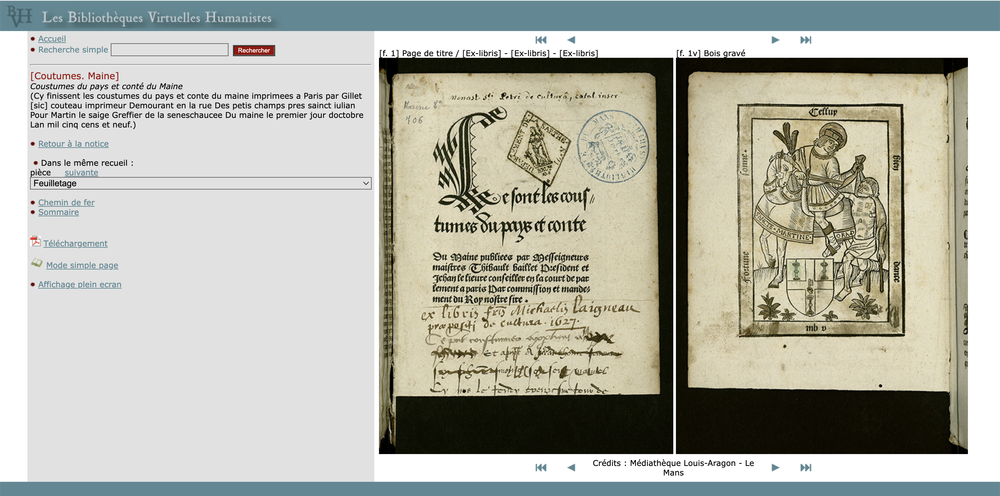

# API Image

<script src="../extras.js"></script>
<script src="viewer.js"></script>

## Objectifs

 * Comprendre l'intérêt de l'API Image
 * Être capable de modifier une image en manipulant les paramètres d'URL définis dans l'API
 * Comprendre les différents types ou niveaux d'implémentation de l'API (level0, level1 etc)
 * Connaître et tester quelques outils s'appuyant sur l'API Image

## Introduction

 * Qu'est-ce que l'API Image ? Un "contrat" entre un serveur d'images et un client de visualisation.
 * C'est la base de toutes les API IIIF, et la première à avoir vu le jour (1er draft en 2012).
 * Une des plus faciles à implémenter, dans la mesure où il existe des serveurs d'images développés par d'autres, qu'il "suffit" d'installer et de configurer.
 
 Spécification de l'API Image : [https://iiif.io/api/image](https://iiif.io/api/image)

## Origine

L'idée d'une API Image standard naît de plusieurs besoins communs au sein des bibliothèques :

 * disposer d'un mécanisme simple de fourniture d'images numériques en ligne, y compris en haute résolution (par exemple pour des projets de bibliothèques virtuelles)
 * rendre plus cohérente la diffusion en ligne des numérisations et faciliter leur exploitation dans différents outils, au sein même de l'institution ou en dehors
 * proposer du zoom profond performant
 

Pour illustrer le 2e point, prenons un cas dans lequel la mise en ligne d'un document implique de créer plusieurs dérivés d'une même image (ici les Bibliothèques virtuelles humanistes - BVH, CESR) :

1. Vignette (100 x 135 pixels) :

    

2. Moyenne taille n°1 (250 x 337 pixels) :

    

3. Moyenne taille n°2 (500 x 674 pixels) :

    

4. Image en haute résolution, non accessible, destiné à l'archivage (TIFF le plus souvent, de plusieurs dizaines voire centaines de Mo).

Ces différentes versions de l'image sont exploitées dans un visualiseur ad hoc :



[Voir sur le site des BVH](http://www.bvh.univ-tours.fr/Consult/consult.asp?numtable=B721816101_RIA_062_1&numfiche=1341&mode=3&offset=3&ecran=0)

Autre exemple : [BVMM (IRHT)](https://bvmm.irht.cnrs.fr/consult/consult.php?mode=ecran&panier=false&reproductionId=4245&VUE_ID=936641&carouselThere=false&nbVignettes=4x3&page=1&angle=0&zoom=moyen&tailleReelle=)

Avec l'agrandissement des écrans et l'augmentation des débits internet, les tailles limitées des images devenaient une vraie contrainte d'usage. 

Bien que les images haute résolution (notamment les images Tiff issues de la numérisation) demeuraient trop volumineuses pour être mises sur le Web, il y avait un besoin de plus en plus prégnant de permettre la consultation en ligne d'images de meilleure qualité, de supporter de nouveaux modes d'accès comme les terminaux mobiles (smartphones, tablettes etc.), et de satisfaire les usages numériques de plus en plus pointus que les chercheurs faisaient des collections.

La solution adoptée par beaucoup d'institutions a été de proposer des visualiseurs avec zoom profond tels quel [Zoomify](http://www.zoomify.com/) and [Microsoft DZI](https://en.wikipedia.org/wiki/Deep_Zoom). Ces clients avaient tendance à utiliser la technologie Flash (aujourd'hui obsolète), et imposent des protocoles propriétaires. En parallèle, le JPEG2000 a commencé à s'imposer comme un format ouvert capable de prendre en charge des visionneuses zoomables.

C'est dans ce contexte, au tournant des années 2010, que IIIF émerge.


## Apports

L'API Image de IIIF apporte :

 * une **syntaxe d'URL standard** pour accéder à une image et la manipuler à distance
 * des **informations techniques sur l'image** pour qu'un visualiseur puisse l'afficher dans différents contextes
 * des URL d'images "bidouillables" par un humain
 * des URL facilitant la mise en cache
 
Cette syntaxe d’URL concerne deux types de requêtes sur une même image :

 * requête de l’image elle-même (pixels)
 * requête d’information sur l’image (JSON)
 
 
### Requête d’image

``` title="Modèle d'URL"
{scheme}://{server}{/prefix}/{identifier}/{region}/{size}/{rotation}/{quality}.{format}
```

Ce mécanisme d'URL permet à un client d'appeler et manipuler une image selon des paramètres de région (`region`), de taille (`size`), de rotation (`rotation`), de qualité (`quality`) et de format (`format`). 

Par exemple il est possible de demander la version pleine taille d'une image, ou simplement une portion de celle-ci (zone d'intérêt au sein de l'image), de la redimensionner, de la faire pivoter ou la retourner horizontalement ou verticalement, de la passer en noir et blanc, etc.

Nous allons détailler pas à pas les différents paramètres d'URL dans les pages suivantes.

### Requête d'information sur l'image

``` title="Modèle d'URL"
{scheme}://{server}{/prefix}/{identifier}/info.json
```
