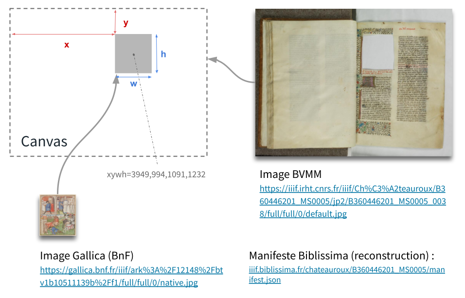

# Exemples et démos

## Canevas (cas "complexes")

Voyons quelques exemples de Manifestes avancés dans lesquels la notion de Canevas prend tout son sens :

1. Canevas vides (pages manquantes) :

    - _Biblissima_: Reconstruction virtuelle d'un manuscrit dispersé (« Florus dispersus ») | [Page web](https://demos.biblissima.fr/florus/#florus-dispersus) -- [Manifeste JSON (v2)](https://demos.biblissima.fr/iiif/metadata/florus-dispersus/manifest.json) -- [Ouvrir dans Mirador](https://portail.biblissima.fr/m3/?theme=dark&context=collection&iiif-content=https://demos.biblissima.fr/iiif/metadata/florus-dispersus/manifest.json)

2. Un Canevas, plusieurs images (fragment) :

    - _Biblissima_ : Reconstruction virtuelle (partielle) d'un manuscrit mutilé (Châteauroux, BM, ms. 5) | [Page web](https://demos.biblissima.fr/chateauroux/) -- [Manifeste JSON (v2)](https://demos.biblissima.fr/iiif/metadata/BVMM/chateauroux/manifest.json) -- [Ouvrir dans Mirador](https://portail.biblissima.fr/m3/?theme=dark&context=collection&iiif-content=https://demos.biblissima.fr/iiif/metadata/BVMM/chateauroux/manifest.json)
    

3. Un Canevas, plusieurs images (images multispectrales) + annotations textuelles :

    - _Library of Congress_ : Lettre numérisée par imagerie hyperspectrale, avec affichage de la transcription du texte et des différentes couches d'image | [Manifeste JSON (v2)](https://dvp.prtd.app/hamilton/manifest.json) -- [Ouvrir dans Mirador](https://portail.biblissima.fr/m3/?theme=dark&context=collection&iiif-content=https://dvp.prtd.app/hamilton/manifest.json)

4. Un Canevas, plusieurs images (rabat, élément dépliable) :

    - _Durham University_ : Page de manuscrit avec rabat | [Page web](https://iiif.durham.ac.uk/index.html?manifest=t1mz029p473h&canvas=t1t05741s32v) -- [Manifeste JSON (v2)](https://iiif.durham.ac.uk/manifests/trifle/32150/t1/mz/02/t1mz029p473h/manifest) -- [Ouvrir dans Mirador](https://portail.biblissima.fr/m3/?theme=dark&context=collection&iiif-content=https://iiif.durham.ac.uk/manifests/trifle/32150/t1/mz/02/t1mz029p473h/manifest)

5. Un Canevas annoté avec du texte :

    - _Bodleian Library, Oxford_ : Manuscrit arabe illustré, portant de nombreuses annotations IIIF de formes diverses (voir fols. 2b and 3a) | [Page web](https://digital.bodleian.ox.ac.uk/objects/748a9d50-5a3a-440e-ab9d-567dd68b6abb/) -- [Manifeste JSON (v2)](https://iiif.bodleian.ox.ac.uk/iiif/manifest/748a9d50-5a3a-440e-ab9d-567dd68b6abb.json) -- [Ouvrir dans Mirador](https://portail.biblissima.fr/m3/?theme=dark&context=collection&iiif-content=https://iiif.bodleian.ox.ac.uk/iiif/manifest/748a9d50-5a3a-440e-ab9d-567dd68b6abb.json)

## Collections

Quelques exemples d'usages variés des Collections IIIF :

1. Un livre en plusieurs volumes :

    - _Wellcome Library_ : une Collection regroupant 6 Manifestes (1 par volume) | [Page web](https://wellcomecollection.org/works/ysmqsfhg/items) -- [Collection JSON (v2)](https://iiif.wellcomecollection.org/presentation/b18031511) -- [Ouvrir dans UV](https://uv-v3.netlify.app/#?c=&m=&cv=&manifest=https://iiif.wellcomecollection.org/presentation/b18031511)
    
2. Un fonds d'archives :

    - _National Library of Wales_ : une Collection arborescente, avec un Manifeste pour chaque pièce au dernier niveau de l'arbre | [Collection JSON (v2)](http://dams.llgc.org.uk/iiif/archive/3975658/fonds.json) -- [Ouvrir dans UV](http://universalviewer.io/uv.html?manifest=http://dams.llgc.org.uk/iiif/archive/3975658/fonds.json#?c=0&m=0&s=0&cv=0&xywh=-3297%2C-245%2C9685%2C4871)

3. Une collection ancienne de manuscrits :

    - _Biblissima_ : une Collection générée dynamiquement regroupant des Manifestes de plusieurs bibliothèques (bibliothèque médiévale dispersée) | [Page web](https://portail.biblissima.fr/fr/ark:/43093/coldata5151005ea5833e5a05e2639cbb210946cb7e0609) -- [Collection JSON (v2)](https://portail.biblissima.fr/iiif/collection/ark:/43093/coldata5151005ea5833e5a05e2639cbb210946cb7e0609) -- [Ouvrir dans Mirador](https://portail.biblissima.fr/m3/?theme=dark&context=collection&iiif-content=https://portail.biblissima.fr/iiif/collection/ark:/43093/coldata5151005ea5833e5a05e2639cbb210946cb7e0609)
    
4. Un ensemble de témoins manuscrits portant des oeuvres de l'érudit anglais du 13e siècle Robert Grosseteste :

    - _Biblissima_ : une Collection générée à partir d'une sélection faite parmi une liste de résultats du moteur IIIF-Collections | [Page web](https://iiif.biblissima.fr/collections/mirador?collection=https://iiif.biblissima.fr/collections/collection/6374e2e7204ef403870f00f2) -- [Collection JSON (v2)](https://iiif.biblissima.fr/collections/collection/6374e2e7204ef403870f00f2) -- [Ouvrir dans Mirador](https://portail.biblissima.fr/m3/?theme=dark&context=collection&iiif-content=https://iiif.biblissima.fr/collections/collection/6374e2e7204ef403870f00f2)

## Manifestes "remix"

1. Biblissima - Collection d'enluminures portant une représentation de comètes : [Page web](https://portail.biblissima.fr/ark:/43093/descdbf571c2dcac868496312bf36d449401e4ac0af4) -- [Manifeste JSON (v2)](https://portail.biblissima.fr/iiif/manifest/ark:/43093/descdbf571c2dcac868496312bf36d449401e4ac0af4) -- [Ouvrir dans Mirador](https://portail.biblissima.fr/m3/?theme=dark&context=collection&iiif-content=https://portail.biblissima.fr/iiif/manifest/ark:/43093/descdbf571c2dcac868496312bf36d449401e4ac0af4)

2. Biblissima - Collection d'enluminures issue d'une requête combinant les termes « Planète » et « Cosmographie » : [Page web](https://portail.biblissima.fr/fr/iconography) -- [Manifeste JSON (v2)](https://portail.biblissima.fr/iiif/manifest?descriptors=AND|569c70bc8f3f52b8966895b97ace86644dca444a,AND|86e65567ec9ac97ea2404af46cafa34d6f4920e7) -- [Ouvrir dans Mirador](https://portail.biblissima.fr/m3/?theme=dark&context=collection&iiif-content=https://portail.biblissima.fr/iiif/manifest?descriptors=AND|569c70bc8f3f52b8966895b97ace86644dca444a,AND|86e65567ec9ac97ea2404af46cafa34d6f4920e7)

## Manifestes audio/vidéo

1. Vidéo avec sous-titres (WebVTT) :

    - _Interview with Becky Jackson, 2019-11-09 (University of Tennessee)_ | [Page web](https://rfta.lib.utk.edu/interviews/object/becky-jackson-2019-11-09/) -- [Manifeste JSON (v3)](https://digital.lib.utk.edu/assemble/manifest/rfta/32) -- [Ouvrir dans Clover](https://samvera-labs.github.io/clover-iiif/?iiif-content=https://digital.lib.utk.edu/assemble/manifest/rfta/32)
    
2. Vidéo avec index de navigation (par acte et scène) :

    - _L'Elisir D'Amore_ | [Manifeste JSON (v3)](https://iiif.io/api/cookbook/recipe/0026-toc-opera/manifest.json) -- [Ouvrir dans UV](https://uv-v3.netlify.app/#?c=&m=&s=&cv=&manifest=https%3A%2F%2Fiiif.io%2Fapi%2Fcookbook%2Frecipe%2F0026-toc-opera%2Fmanifest.json&rid=https%3A%2F%2Fiiif.io%2Fapi%2Fcookbook%2Frecipe%2F0026-toc-opera%2Frange%2F4)
    
3. Vidéos et audios lus dans Mirador :

    - Mirador Viewer - video | [Page web](https://mirador-dev.netlify.app/__tests__/integration/mirador/video.html)
    
4. Série de séquences vidéo (1 Canevas par vidéo) :

    - _Northwestern Football vs. Syracuse, 1984 (Northwestern University Libraries)_ | [Manifeste JSON (v3)](https://iiif.stack.rdc.library.northwestern.edu/public/iiif3/24/68/7f/7d/-1/59/5-/4f/56/-8/3b/2-/5f/93/36/72/86/b3-manifest.json) -- [Ouvrir dans Clover](https://samvera-labs.github.io/clover-iiif/?iiif-content=https://iiif.stack.rdc.library.northwestern.edu/public/iiif3/24/68/7f/7d/-1/59/5-/4f/56/-8/3b/2-/5f/93/36/72/86/b3-manifest.json)

5. Segmentation audio (Manifest avec Range) :

    - _IIIF Timeliner (University of Indiana)_ | [Page web](https://timeliner.dlib.indiana.edu) -- [Manifeste JSON (v3)](https://demo.avalonmediasystem.org/timelines/59/manifest.json)
    
6. Annotation vidéo :

    - _走るネコの姿・狩りの秘密_ (Mirador) | [Page web](https://dzkimgs.l.u-tokyo.ac.jp/videos/m3/cat_video.html) -- [Manifeste JSON (v3)](https://dzkimgs.l.u-tokyo.ac.jp/videos/cat2020/manifest.json)

7. Vidéo synchronisée avec transcription XML-MEI :

    - _Étude in F Minor_ (IIIF AV Player) | [Page web](https://ddmal.music.mcgill.ca/IIIF-AV-player/) -- [Manifeste JSON (v3)](https://ddmal.music.mcgill.ca/IIIF-AV-player/samples/Chopin_Etude_Op_10_No_9_vid/manifest_chopin_etude_vid_multicanvas.json)
