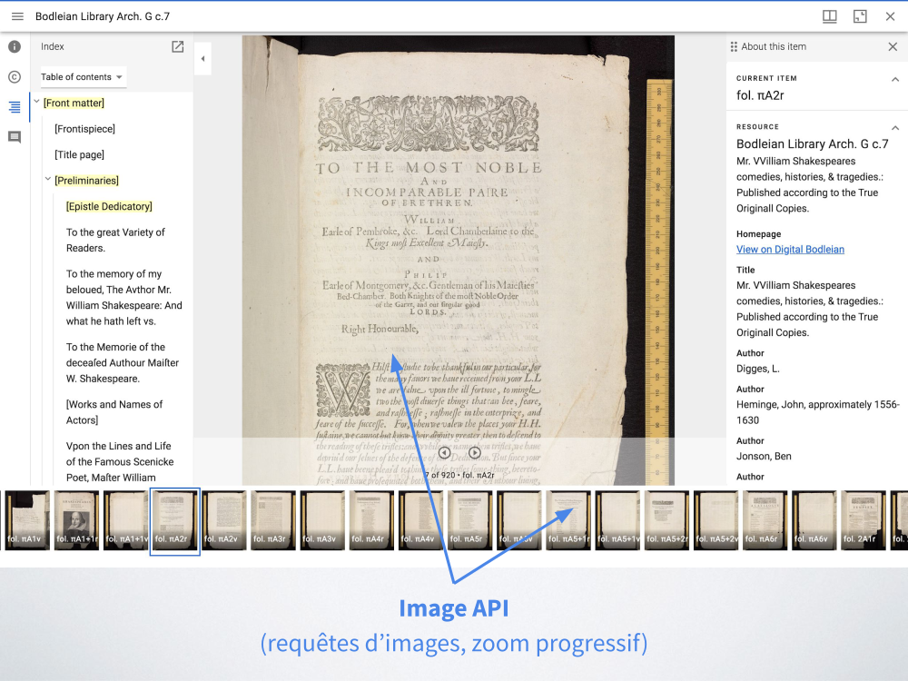
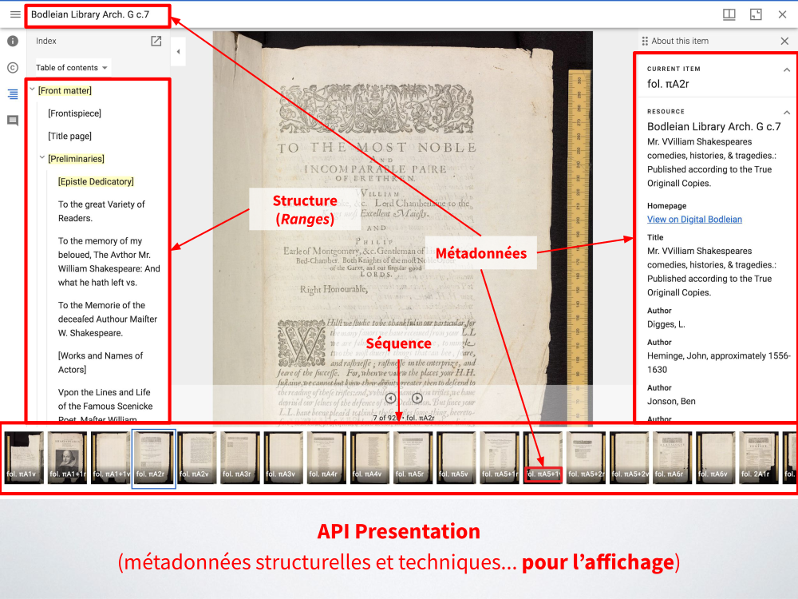
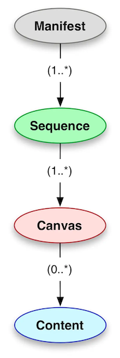
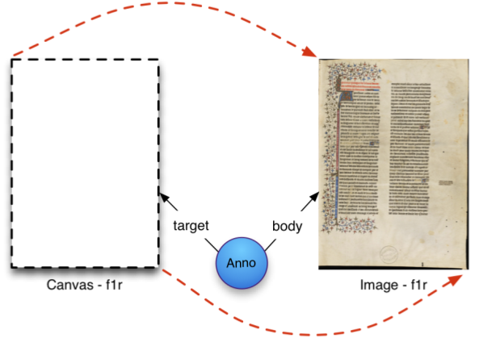
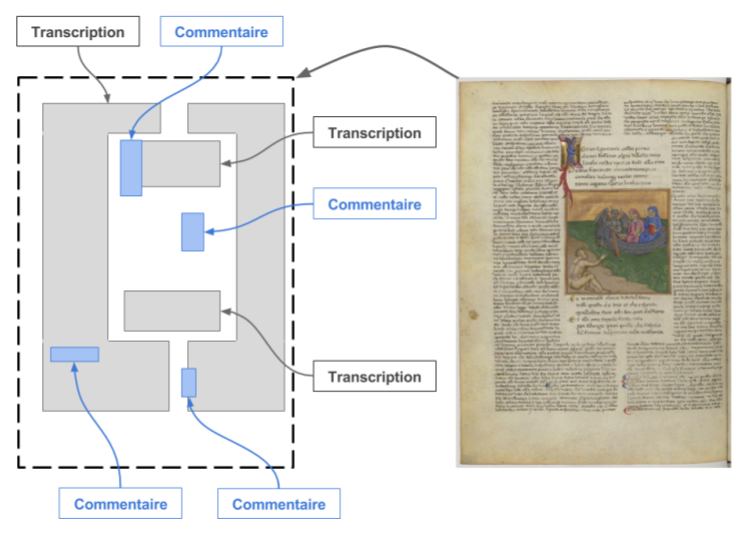

# API Présentation

On a vu dans la partie précédente que l'API Image permettait de délivrer et partager des images, mais elle s'occupe essentiellement de délivrer des pixels et ne traite qu'une seule image à la fois...

- Quid de plusieurs images ? (éléments de structure ou de séquence)
- Quid des informations de contexte ? (métadonnées)
- Quid des annotations ?

C'est à ce niveau là qu'intervient l'API Présentation, la deuxième API formant le coeur de IIIF.

Spécification de l'API Présentation : [https://iiif.io/api/presentation](https://iiif.io/api/presentation)

## Principe

L’API Présentation spécifie les **métadonnées descriptives, structurelles, et techniques** nécessaires à la présentation d’un objet numérique dans une interface (par exemple un visualiseur d’images, ou tout autre environnement manipulant des images et autres médias supportés par IIIF).

Toutes ces informations sont contenues dans un fichier appelé **« Manifeste »** :

- c'est une sorte d’enveloppe virtuelle formant l’unité de distribution élémentaire dans l’univers IIIF. 
- c’est en général ce fichier Manifeste que vont manipuler les logiciels pour interagir avec une ressource, la visualiser, l'importer, ou la transférer vers un autre outil.

L’API Présentation est le modèle sous-jacent selon lequel est construit un Manifeste. Cette API constitue à la fois :

- un format d’échange, sérialisé en [JSON-LD](https://json-ld.org)
- un modèle de données décrivant la représentation numérique d’un objet, qu'il soit numérisé ou nativement numérique.

!!! warning

    L'API Présentation se limite à spécifier la **sémantique de présentation**, et non la sémantique de description de l’objet lui-même. Ce n'est pas un énième standard de métadonnées qui chercherait à se substituer à des schémas tels que Dublin Core, EAD, MODS, LIDO, MARC-XML, TEI, etc. L'API Présentation permet toutefois d'embarquer des métadonnées descriptives de l'objet mais celles-ci ne sont pas porteuses d'une sémantique particulière.

Utilisation des API Image et Présentation dans Mirador :





## Modèle

| API 2.1 | API 3.0 |
| :--:  | :--:        |
| { width=250 } | { width=300 } |

Le modèle des versions 2.1 et 3.0 de l'API Présentation présentent certes quelques différences, mais en substance les types de ressources restent identiques. 

Leur tronc commun peut être représenté ainsi :

{ width=150 }

### Principaux types de ressources

#### Manifeste

Un Manifeste IIIF représente le plus souvent le fac-similé numérique (_digital surrogate_) d’un objet physique (livre, manuscrit, périodique, carte, peinture, photographie, partition, monnaie, objet archéologique, archive sonore, captation vidéo, etc.). On a donc en général un Manifeste pour chaque item numérisé dans une collection.

Mais un Manifeste peut aussi bien représenter un objet virtuel et composite constitué d’une série d’images ou autres médias rassemblés à des fins scientifiques ou pédagogiques, et pouvant provenir de différentes collections.

Voici les principales composantes d'un Manifeste (indépendamment de la version de l'API) :


#### Canevas

Un Manifeste est constitué d’une séquence ordonnée de Canevas (_Canvas_) auquel on associe un ou plusieurs Contenus.

Un Canevas représente une “vue” d'un objet :

- c'est un espace abstrait sur lequel on “peint” du contenu (comme PowerPoint !)
- un Canevas a une largeur et une hauteur qui définisent un espace de coordonnées en deux dimensions permettant de positionner précisément un ou plusieurs contenus sur ce Canevas.

#### Contenu

Un Contenu “annote” un Canevas :

- ce peut être une image, un enregistrement audio, une vidéo ou du texte
- l'association entre un Contenu et un Canevas se fait via une **Annotation**
- l'Annotation peut occuper la totalité de l'espace de Canevas ou cibler une zone particulière de celui-ci

Pour illustrer ce principe du Canevas et de l'annotation sur celui-ci, commentons les images suivantes :

<figure markdown>
  { width=500 }
  <figcaption>Une Image (body) est associée à un Canevas (target) via une Annotation.</figcaption>
</figure>

<figure markdown>
  <iframe width="560" height="315" src="https://www.youtube.com/embed/98z9YNFiUqU?clip=Ugkxj9S00qdxJ47fKhNHB0HIXBUJlaO688DO&amp;clipt=EMvhFhjj5Bk" title="YouTube video player" frameborder="0" allow="accelerometer; autoplay; clipboard-write; encrypted-media; gyroscope; picture-in-picture" allowfullscreen></iframe>
  <figcaption>Principe du Canevas et de l'annotation d'image, expliqué en vidéo (Mike Appleby).</figcaption>
</figure>

<figure markdown>
  { width=500 }
  <figcaption>Un Canevas peut aussi être la cible d'autres types d'annotations (transcription, commentaires, tags etc.) ciblant des zones particulières au sein de cet espace de coordonnées.</figcaption>
</figure>

Nous verrons juste après comment ce principe de Canevas prend forme en JSON.


#### Collection

Comme on le voit dans la représentation du modèle de l'API Présentation (voir ci-dessus), il existe un autre type de ressource au-dessus du Manifeste : la Collection. 

Une Collection est simplement un regroupement de Manifestes. Sous sa forme la plus basique, elle se présente comme un document JSON listant des URL de Manifests.

Une Collection IIIF permet par exemple :

- de charger des listes de Manifestes, pré-définies par un système ou constituées par des utilisateurs
- de visualiser des listes ou des hiérarchies de Manifestes reliés entre eux
- de représenter des livres en plusieurs volumes

Nous verrons quelques exemples d'utilisation concrète dans la section suivante.

## Anatomie d'un Manifeste

Inspectons ensemble la structure et les différentes composantes d'un Manifeste IIIF :

```json title="(1) Manifest"
{
  "@context": "http://iiif.io/api/presentation/2/context.json",
  "@type": "sc:Manifest",
  "@id": "https://example.org/object1/manifest.json",
  "label": "Object 1",
  "metadata": [ ...métadonnées de l'objet... ],
  "sequences": [ 
    {
      "@id": "https://example.org/object1/sequence/1",
      "canvases": [ ...liste des Canevas (2)... ]
    }
  ]
}
```

```json title="(2) Canevas"
{
  "@type": "sc:Canvas",
  "@id": "https://example.org/object1/canvas/1",
  "label": "folio 1r",
  "width": "1500",
  "height": "2000",
  "images": [ ...liste des images de ce Canevas (3)... ]
}
```

```json title="(3) Contenu : une image associée à un Canevas via une annotation"
{
  "@type": "oa:Annotation",
  "@id": "https://example.org/object1/canvas/1/anno/1",
  "motivation": "sc:painting",
  "on": "https://example.org/object1/canvas/1",
  "resource": {
    "@id": "https://example.org/iiif/1234/full/1500,/0/default.jpg",
    "@type": "dctypes:Image",
    "format": "image/jpeg",
    "height": 2000,
    "width": 1500,
    "service": { ...service API Image (4)... }
  }
}
```

```json title="(4) Service API Image"
{
  "@context": "http://iiif.io/api/image/2/context.json",
  "@id": "https://example.org/iiif/1234", // URL de base du service API Image de l'image "1234"
  "profile": "http://iiif.io/api/image/2/level2.json"
}
```

```json title="(5) Liste d'annotations référencée dans un Canevas via la propriété otherContent"
{
  "@type": "sc:Canvas",
  "@id": "https://example.org/object1/canvas/1",
  "label": "folio 1r",
  "width": "1500",
  "height": "2000",
  "images": [ ...liste des images de ce Canevas (3)... ],
  "otherContent": [
    {
      "@id": "https://example.org/object1/annotationlist/list1.json",
      "@type": "sc:AnnotationList"
    }
  ]
}
```

Maintenant, entrons davantage dans le détail avec un exemple réel :

- [https://purl.stanford.edu/hg676jb4964/iiif/manifest](https://purl.stanford.edu/hg676jb4964/iiif/manifest) (API Présentation v2)
- [https://purl.stanford.edu/hg676jb4964/iiif3/manifest](https://purl.stanford.edu/hg676jb4964/iiif3/manifest) (API Présentation v3)


## Prise en charge de l'audio et vidéo

La dernière version de l'API Présentation (3.0), publié en 2020, intègre le support des médias audio et vidéo.

En termes de spécifications, cela se traduit par l'ajout une dimension temporelle au Canevas (via une propriété `duration`) : il devient ainsi possible d’annoter non plus seulement une zone spatiale du Canevas mais aussi un point ou une étendue temporelle :

``` title="URI d'un Canevas avec un fragment (xywh) ciblant une zone spatiale et une étendue temporelle (t)"
https://example.org/object1/canvas/1#xywh=70,60,500,100&t=5,20
```

Dans le cas de l'audio, il n'y a pas de dimension spatiale, mais uniquement temporelle (donc un Canevas sans hauteur ni largeur, avec simplement une durée).

Comme dans le cas des images, le Manifeste permet de véhiculer un ensemble d'informations relatives à la ressource audio ou vidéo :

- séquence (face A/B d'un disque vinyle, pistes d'un album CD...)
- structure (actes et scènes d'un opéra, segments d'une émission radiophonique...)
- métadonnées descriptives, droits et attribution
- annotations et autres ressources (sous-titres, transcription vidéo, commentaires, liens, images etc.)

**Pourquoi n'y a-t-il pas d'API Audio/Vidéo dans IIIF (au même titre que l'API Image) ?**

A la différence des images HD, la diffusion en ligne de médias audio/vidéo ne requiert pas l'équivalent d'un serveur d'images capable de générer des dérivés à la volée en réponse à des requêtes d'API. En effet, les navigateurs Web sont nativement capables de lire des fichiers audio/vidéo, de faire des requêtes partielles et donc de "streamer" des contenus de ce type (_"byte-range requests"_), ce qui n'est pas le cas des images JPEG2000 ou TIFF. Des formats vidéo tels que MPEG-DASH ou HLS permettent de gérer ce streaming et remplissent en quelque sorte déjà le même rôle que l'API Image. 

Il y a des cas d'usage dans lesquels il serait pertinent d'avoir les mêmes possibilités d'adressage et de manipulation dynamique que l'API Image pour des documents audio/vidéo, mais ils n'ont pas été jugés prioritaires par la communauté IIIF lors de l'élaboration de l'API Présentation 3.0.

La Library of Congress a pris l'initiative de créer une API Audio/Vidéo inspirée de l'API Image, en particulier dans l'optique de rendre citable via une URL des segments d'un fichier sonore ou vidéo. Voir [Streaming Services - An audio and video (A/V) delivery API for the Library of Congress](https://www.loc.gov/apis/micro-services/streaming-services/).

Voyons quelques exemples dans la section suivante "Exemples et démos".
