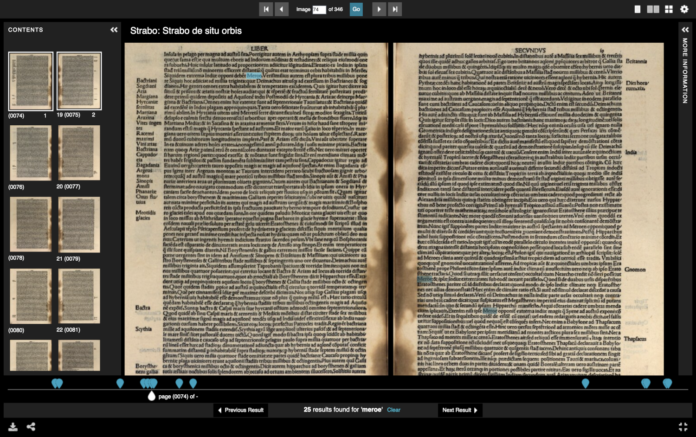

# Les API additionnelles de IIIF

## API Authorization Flow

Cette spécification décrit un ensemble de workflows d’interaction entre un client et des systèmes d’authentification (CAS, OAuth2). Son but n'est pas de gérer l'authentification en elle-même mais plutôt de guider l'utilisateur dans l'accès à une ressource en accès restreint, indépendamment du client utilisé. Ainsi l'API sert de passerelle entre une application cliente et un système de contrôle d'accès quelconque, sans que le client ait besoin de connaître quel est ce système ou comment il fonctionne.

Voir le workflow de l'API Auth du point de vue d'un client : [https://iiif.io/api/auth/2.0/#workflow-from-the-browser-client-perspective](https://iiif.io/api/auth/2.0/#workflow-from-the-browser-client-perspective)

<figure markdown>
  
  <figcaption>Scénario "login" : <em><a href="https://access.bl.uk/item/viewer/ark:/81055/vdc_000000021732">The Song of Tiadatha. [A poem.]</a></em> (British Library)</figcaption>
</figure>

<figure markdown>
  
  <figcaption>Scénario "login" avec accès à une image dégradée : <em><a href="https://purl.stanford.edu/ds199xg9454">Malcolm B [ ] correspondence, to Miriam Kropp, 1948-1950</a></em> (Stanford)</figcaption>
</figure>

<figure markdown>
  
  <figcaption>Scénario "click through" nécessitant l'acceptation des termes d'utilisation : <em>Correspondence 1953-1968</em> (Wellcome Collection)</figcaption>
</figure>

Spécification de l'API Authentification : [https://iiif.io/api/auth/](https://iiif.io/api/auth/)

## API Content Search

Cette API spécifie un service web pour rechercher au sein d'une ressource IIIF.

- Il ne s'agit pas de rechercher pour trouver la ressource a priori mais bien de rechercher au sein de celle-ci après l'avoir trouvée (équivalent d'un Control+F dans un PDF). La recherche porte donc sur une seule ressource et va cibler les annotations associées à celle-ci (et non les métadonnées descriptives) : OCR, transcription, traduction ou édition du contenu textuel, ou annotations de type commentaire, tags etc. 
- Ce type de fonctionnalité est particulièrement pertinente pour rechercher dans le texte intégral d'un document multi-pages. C'est le cas d'usage principal pour lequel cette API est implémentée.

La plus-value de cette API est évidemment son caractère interopérable et distribué, comme le sont toutes les API IIIF par essence : le service web peut être exploité par des visualiseurs différents, et il peut très bien être fourni par un tiers (un Manifeste fourni par A peut référencer un service API Content Search créé par B et être utilisé dans un visualiseur mis à disposition par C).

L'API Content Search définit deux services web :

- recherche
- autocomplétion

Spécification de l'API Content Search : [https://iiif.io/api/search/](https://iiif.io/api/search/)

Voyons deux cas concrets d'utilisation de l'API Content Search dans deux client différents :

### Démo

<figure markdown>
  
  <figcaption><a href="https://www.digitale-sammlungen.de/en/view/bsb10139933?q=meroe&page=74,75">Strabo de situ orbis</a> (München, Bayerische Staatsbibliothek)</figcaption>
</figure>

<figure markdown>
  
  <figcaption>Le même document avec la même fonctionnalité de recherche, <a href="https://uv-v3.netlify.app/#?c=&m=&cv=73&xywh=-279%2C-232%2C5433%2C3459&manifest=https://api.digitale-sammlungen.de/iiif/presentation/v2/bsb10139933/manifest">cette fois dans Universal Viewer</a></figcaption>
</figure>

Dans ces deux exemples on observe que le service API Content Search de la bibliothèque de Munich (BSB) est appelé de la même façon par Mirador et par Universal Viewer et qu'il renvoie une liste d'occurrences structurée sous la forme d'une `AnnotationList` ([https://api.digitale-sammlungen.de/iiif/services/search/v1/bsb10139933?q=meroe](https://api.digitale-sammlungen.de/iiif/services/search/v1/bsb10139933?q=meroe)).

Il existe quelques [logiciels côté serveur](https://github.com/IIIF/awesome-iiif/#content-search-api) qui implémentent l'API Content Search, tels que Ocracoke ou Whiiif.
Côté client, Mirador et Universal Viewer supportent bien cette fonctionnalité.

## API Content State

L'API Content State décrit un mécanisme pour faire référence à une ou plusieurs ressources IIIF, voire une ou plusieurs parties de ressources, dans un format compact qui peut être utilisé par un client pour initialiser une vue de cette ressource.

Concrètement, cela permet d'apporter une solution technique commune à la question de :

- comment pointer sur des ressources IIIF ou parties de ressources (citabilité)
- comment partager des ressources IIIF entre applications (portabilité, ou comment initialiser une vue d’une ou plusieurs ressources IIIF indépendamment de l’interface et des fonctionnalités proposées par tel ou tel logiciel).

Par exemple, citons deux cas d'usage possibles :

- à partir d'une liste de résultats, un utilisateur clique sur un lien pour ouvrir une ressource dans un visualiseur IIIF. Ce visualiseur est capable de pointer l'utilisateur sur la partie de la ressource où l'occurrence du terme recherché apparaît (cf. exemple de la BSB ci-dessus). Le protocole défini par l'API Content State permet de dire au client quel Manifeste ouvrir, sur quel Canevas se trouve l'occurrence et dans quel zone de ce Canevas.
- un utilisateur ouvre plusieurs Manifestes pour comparer des images entre elles et veut partager cet ensemble de vues avec une autre personne.

Ce deuxième cas correspond à ce qui est proposé par l'instance Mirador 2 du Portail Biblissima : exemple d'une session Mirador avec 2 manuscrits côte à côte (mais non conforme à l'API Content State) : [https://portail.biblissima.fr/mirador?key=rO7l5308mdIElAjnpVgR&version=1](https://portail.biblissima.fr/mirador?key=rO7l5308mdIElAjnpVgR&version=1). 

La spécification officielle donne aussi à titre d'exemple le cas des signets (bookmarks), des playlists, ou de liens profonds au sein d'un objet numérique.

Un autre moyen d'illustrer l'usage de cette API est de revenir à l'exercice fait avec Mirador tout à l'heure, lorsqu'on a utilisé la fonction d'export/import de l'espace de travail. Les informations incluses dans le morceau de JSON étaient spécifiques à Mirador 3 : elles permettent à une instance A de Mirador d'échanger une session avec une instance B de Mirador, mais pas avec Universal Viewer ou un autre client. L'idée de l'API Content State est de permettre cet échange quel que soit le client en encodant ces informations de façon standardisée.

L'API Content State spécifie principalement deux éléments :

- une façon d'encoder ces informations sur "l'état du contenu" (c'est-à-dire de quels Manifestes, de quels Canevas, ou de quelle zone ou étendue temporelle d'un Canevas est constitué cet "état"). L'API définit donc d'abord une structure de données en JSON-LD, basée sur le principe de l'annotation (comme presque tout en IIIF) ;
- une série de "protocoles" de transfert de ces données entre applications, qui s'appuient sur des fonctionnalités natives de tous les navigateurs web modernes.

Les protocoles définis pour transférer cet état sont les suivants :

- paramètre de requête HTTP GET (`?iiif-content=`)
- paramètre de requête HTTP POST
- copier/coller (via l'événement Paste en Javascript)
- glisser/déposer (via la Web API HTML5 Drag and Drop)
- upload d'un fichier (via l'interface FileReader de l'API File)

Un bon article expliquant le principe de l'API Content State : [What is IIIF Content State?](https://tom-crane.medium.com/what-is-iiif-content-state-dd15a543939f) (Tom Crane).

Spécification de l'API Content State : [https://iiif.io/api/content-state](https://iiif.io/api/content-state)

### Démo

<figure markdown>
  
  <figcaption>Session Mirador initialisée avec 3 Canevas issus de 3 Manifestes différents</figcaption>
</figure>

Voyons par exemple comment initialiser un environnement IIIF avec un ou plusieurs ressources IIIF. Ici il s'agit de Mirador mais le même comportement peut être extrapolé à n'importe quel outil ou logiciel (outil d'exposition virtuelle, plateforme de transcription, CMS...) :

- [1 Manifeste IIIF](https://portail.biblissima.fr/m3/?theme=light&iiif-content=https://www.loc.gov/item/2021667873/manifest.json)
- [1 Collection IIIF](https://portail.biblissima.fr/m3/?theme=light&iiif-content=https://portail.biblissima.fr/iiif/collection/ark:/43093/coldata5151005ea5833e5a05e2639cbb210946cb7e0609)
- [3 Canevas issus de 3 Manifestes différents](https://portail.biblissima.fr/m3/?theme=light&iiif-content=ew0KICAiQGNvbnRleHQiOiAiaHR0cDovL2lpaWYuaW8vYXBpL3ByZXNlbnRhdGlvbi8zL2NvbnRleHQuanNvbiIsDQogICJpZCI6ICJodHRwczovL2V4YW1wbGUub3JnL2ltcG9ydC8yIiwNCiAgInR5cGUiOiAiQW5ub3RhdGlvbiIsDQogICJtb3RpdmF0aW9uIjogImNvbnRlbnRTdGF0ZSIsDQogICJ0YXJnZXQiOiBbDQogICAgICB7DQogICAgICAgICAgImlkIjogImh0dHBzOi8vaWlpZi5oYXJ2YXJkYXJ0bXVzZXVtcy5vcmcvbWFuaWZlc3RzL29iamVjdC8yOTk4NDMvY2FudmFzL2NhbnZhcy00NzE3NDg5MiIsDQogICAgICAgICAgInR5cGUiOiAiQ2FudmFzIiwNCiAgICAgICAgICAicGFydE9mIjogWw0KICAgICAgICAgICAgICB7DQogICAgICAgICAgICAgICAgICAiaWQiOiAiaHR0cHM6Ly9paWlmLmhhcnZhcmRhcnRtdXNldW1zLm9yZy9tYW5pZmVzdHMvb2JqZWN0LzI5OTg0MyIsDQogICAgICAgICAgICAgICAgICAidHlwZSI6ICJNYW5pZmVzdCINCiAgICAgICAgICAgICAgfQ0KICAgICAgICAgIF0NCiAgICAgIH0sDQogICAgICB7DQogICAgICAgICAgImlkIjogImh0dHBzOi8vbWVkaWEubmdhLmdvdi9wdWJsaWMvbWFuaWZlc3RzL2NhbnZhcy8xMDYzODIuanNvbiIsDQogICAgICAgICAgInR5cGUiOiAiQ2FudmFzIiwNCiAgICAgICAgICAicGFydE9mIjogWw0KICAgICAgICAgICAgICB7DQogICAgICAgICAgICAgICAgICAiaWQiOiAiaHR0cHM6Ly9tZWRpYS5uZ2EuZ292L3B1YmxpYy9tYW5pZmVzdHMvbmdhX2hpZ2hsaWdodHMuanNvbiIsDQogICAgICAgICAgICAgICAgICAidHlwZSI6ICJNYW5pZmVzdCINCiAgICAgICAgICAgICAgfQ0KICAgICAgICAgIF0NCiAgICAgIH0sDQogICAgICB7DQogICAgICAgICAiaWQiOiAiaHR0cHM6Ly9hcGkuYXJ0aWMuZWR1L2FwaS92MS9hcnR3b3Jrcy84MDYwNy9tYW5pZmVzdC5qc29uIiwNCiAgICAgICAgICJ0eXBlIjogIk1hbmlmZXN0Ig0KICAgICAgfQ0KICBdDQp9)

NB : l'instance Mirador de Biblissima a été modifiée pour supporter le 3e exemple (_"base64url encoding"_).

Observons le contenu encodé du 3e exemple ci-dessus en utilisant l'outil [Base64Decode](https://www.base64decode.org).

Testons ensemble la page [Content State POC](https://iiif.gdmrdigital.com/import_to_viewers/index.html) proposée par Glen Robson qui montre les différentes méthodes de transfert de contenu définies par l'API Content State.

## API Change Discovery

Commençons par enfoncer une porte ouverte : les ressources IIIF, bien que nativement interopérables, n'ont d'utilité que si elles peuvent être trouvées ! En effet, l’interopérabilité introduite par IIIF ne résout pas à elle seule la question de la "trouvabilité" (_findability_) des ressources sur le Web...

- du point de vue d'un utilisateur : comment trouver des ressources disponibles en IIIF ?
- du point de vue d'une institution : comment rendre mes ressources IIIF “découvrables” et indexables par des tiers ?
- du point de vue d'un agrégateur : comment découvrir, moissonner et indexer ces ressources ? comment se maintenir à jour ?

Tout cela est à l'origine d'un des axes de travail de la communauté IIIF ces dernières années, qui a débouché sur la mise au point d'une nouvelle API : l'API Change Discovery. 

Cette API spécifie un mécanisme standard de découverte et de moissonnage en masse de ressources IIIF par des machines (scripts, crawlers etc.). Une des principales mises en application est la construction de moteurs de recherche et portails généralistes ou thématiques, comme cela a été initié par [Cultural Japan](https://cultural.jp/) ou [Biblissima IIIF-Collections](https://iiif.biblissima.fr/collections/). 

Ainsi l'API Change Discovery fournit un mécanisme pour découvrir/rendre découvrables des ressources IIIF :

- elle apporte une méthode cohérente pour publier des listes de ressources IIIF (par ex. des Manifests et des Collections) afin d'en permettre le moissonnage.
- elle permet aussi d'optimiser ce processus en permettant aux "moissonneurs" de récupérer uniquement les ressources qui ont été ajoutées ou modifiées depuis leur dernier passage.

Spécification de l'API Change Discovery : [https://iiif.io/api/discovery](https://iiif.io/api/discovery)
