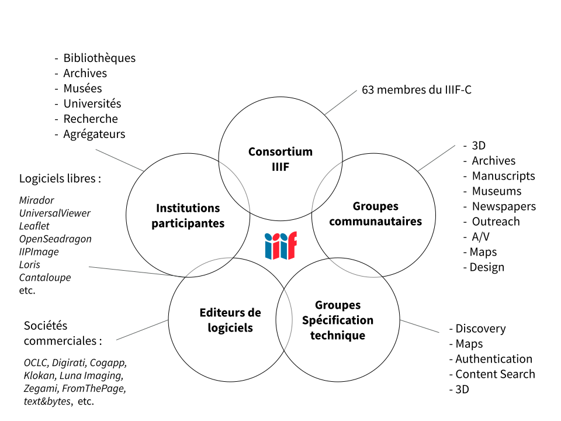

# Introduction à IIIF

IIIF – _International Image Interoperability Framework™_ – désigne à la fois une **communauté** et un **cadre d’interopérabilité** pour les images et documents audio/vidéo sur le Web.

S'il fallait résumer ce qu'est IIIF en deux phrases :

- IIIF désigne un **modèle** et un ensemble de spécifications techniques pour diffuser, présenter et annoter des ressources numériques (images, fichiers audio/vidéo)
- c'est aussi une **communauté**, qui développe des **API** ouvertes, les implémente dans des **logiciels**, et expose des **contenus** interopérables sur le Web.

IIIF représente aujourd'hui :

- plusieurs centaines d'acteurs impliqués dans la vie de la [communauté](https://iiif.io/community/)
- des millions d’objets numériques accessibles via ces standards
- un écosystème de [logiciels compatibles](https://github.com/IIIF/awesome-iiif)

Il s’est imposé en quelques années comme un standard de fait et une brique technologique essentielle pour décloisonner les collections numérisées des institutions patrimoniales à l’échelle mondiale.

## Contextes d'utilisation

IIIF est actuellement utilisé dans des contextes assez variés :

- Bibliothèques (locales à nationales)
- Musées
- Archives
- Recherche
- Enseignement et formation
- Projets en humanités numériques, de plus en plus ayant recours à l'IA/apprentissage automatique
- Sciences et techniques de l’ingénieur (STEM) : bio-imagerie, sciences de la Vie etc.

## Constat

La raison d'être de l'initiative IIIF se fonde sur un constat général de manque d'interopérabilité entre bibliothèques et autres entrepôts d'images numériques disponibles sur le Web :

- chaque entrepôt a été conçu comme un silo : les images ne sont visualisables et exploitables que dans l'emprise du site qui les met à disposition ;
- chaque application est unique : les institutions ont développé leur propre visualiseur et défini leurs propres méthodes de diffusion de leurs images en ligne ;
- l’utilisateur doit s'adapter à chaque environnement : il doit composer avec des interfaces de consultation différentes, ayant chacune ses fonctionnalités propres, sans passerelle possible.

Ce constat intervient au tournant des années 2010, après plus d'une décennie de numérisation de masse, au cours de laquelle ont vu le jour de très nombreuses bibliothèques numériques et projets de portails ou autres reconstitutions virtuelles de collections (dont beaucoup de projets autour des manuscrits médiévaux tels que : _Roman de la Rose_, _Parker on the Web_, _Online Froissart_, _DIAMM - Digital Image Archive of Medieval Music_, ou encore _e-codices_).

Globalement, on s'est aperçu en menant tous ces projets que chacun faisait face aux mêmes défis et problèmes techniques mais y répondait à sa manière, quitte à développer un nouveau visualiseur, mettre en place un serveur d'images, avec tous les coûts de développement et de maintenance que cela implique.

Dans ce contexte d’accès démultiplié aux sources primaires en ligne, les attentes et les pratiques numériques des chercheurs devenaient de plus en plus sophistiquées et cherchaient à s’affranchir des barrières techniques entre les sites : 

- pour mettre côte à côte plusieurs documents numérisés issus de bibliothèques différentes, afin de les comparer ou de les annoter ensemble ; 
- pour restituer l’état originel d’un document en regroupant virtuellement des fragments dispersés ; 
- pour associer aux images des données produites par la recherche, telles que des transcriptions, des commentaires, du son, d’autres images.

## Origine de IIIF

C’est pour tenter de remédier à cette situation que s’est constitué à partir de 2010 un groupe de travail à Stanford dans le cadre d’un financement Mellon : le _Digital Manuscript Technical Working Group (DMSTech)_. Son but était de réfléchir et d'expérimenter autour de méthodes et de technologies permettant l’interopérabilité des manuscrits numérisés. 

Ces réflexions se sont basées sur des cas d’usages spécialisés dans le domaine des manuscrits médiévaux, donc avec beaucoup de cas complexes :

- manuscrits démembrés (feuillets dispersés dans plusieurs bibliothèques, pouvant donner lieu à plusieurs interprétations possibles quant à l’ordre originel des feuillets = plusieurs séquences)
- déliés ou reliés (manuscrits composites, constitués de plusieurs unités codicologiques)
- mutilés (pages manquantes, enluminures découpées)
- palimpsestes (donnent lieu à plusieurs numérisations d’une même page sous différentes lumières pour essayer de lire le texte caché)
- fragments (plusieurs images pour une page originelle, plusieurs interprétations possibles)

Ce travail engagé par DMSTech va déboucher sur l’élaboration d’un modèle de données conçu pour prendre en charge toute cette complexité liée au manuscrit médiéval, _Shared Canvas_ :

- ce modèle permet de décrire la représentation numérique d’un objet physique
- il est lui-même basé sur un autre modèle : _Open Annotation_ (première spécification en février 2013), qui fait aujourd’hui l’objet d’une recommandation du W3C sous le nom de _Web Annotation_ depuis début 2017
- c’est de ce modèle _Shared Canvas_ que dérivent les concepts fondamentaux de l’API Présentation : le _Manifest_, le _Canvas_, et l’_Annotation_ (qui est en fait le paradigme central de IIIF)

De façon concomittente à ces travaux assez spécialisés et centrés sur les manuscrits, d’autres workshops ont commencé à réunir à partir de 2011 des représentants de plusieurs institutions (notamment des bibliothèques nationales, dont la BnF, la British Library et la BN de Norvège) pour réfléchir à un moyen de partager les images de manière plus efficace par le Web, en mettant au point des méthodes communes de requêtes et de "streaming" d’images. C'est ce qui va déboucher sur un premier draft de l’API Image courant 2012.

## Vision

L'ambition de IIIF est de créer un cadre technique commun grâce auquel les fournisseurs de ressources numériques (image, son, vidéo) peuvent :

- délivrer leurs contenus de manière standardisée sur le Web,
- afin de les rendre consultables, manipulables et annotables,
- par n’importe quel logiciel compatible.

<figure markdown>
  
  <figcaption>Schéma - Principe général d’interopérabilité de IIIF : trois applications différentes sont branchées à trois entrepôts IIIF. (Auteur : Régis Robineau) <a href="https://doc.biblissima.fr/assets/schema_iiif.svg">Agrandir l'image</a></figcaption>
</figure>

Dans cet environnement distribué et interopérable, chaque entrepôt devient un point d'accès distant potentiel auquel des applications tierces peuvent se "brancher" et réutiliser les ressources à d'autres fins, sans avoir à les dupliquer et sans en perdre le contexte (grâce aux métadonnées).

En rendant accessibles de vastes corpus d’images et de ressources audiovisuelles, IIIF agit comme un facilitateur pour de nombreux projets et applications utilisant les collections des institutions culturelles et susceptibles de toucher des publics variés : 

- portails thématiques ou spécialisés
- expositions virtuelles
- plateformes de _crowdsourcing_
- événements de type hackathon
- constitution de corpus de recherche
- reconstitutions virtuelles
- projets de transcription automatique (OCR, HTR) ou de vision par ordinateur

## Communauté IIIF

Formée au tournant des années 2010 autour d’un petit noyau de bibliothèques nationales et universitaires, l’initiative IIIF est aujourd’hui portée par un [consortium international](https://iiif.io/community/consortium/) d’une soixantaine d’organisations et animée par une communauté d’acteurs assez large et diverse.

Le rôle principal de la communauté IIIF est d’élaborer, de publier et de faire évoluer de façon concertée les spécifications techniques de IIIF à partir de cas d’usages réels et documentés.

Ces spécifications sont ensuite implémentées dans des logiciels et plateformes de diverses natures (serveurs d’images, visualiseurs, outils d’annotation, systèmes de gestion de contenus, etc.), garantissant ainsi leur interopérabilité.

La communauté dipose de plusieurs canaux de communication :

- liste de discussion [IIIF-Discuss](https://groups.google.com/g/iiif-discuss)
- [newsletter](https://iiif.io/newsletter/)
- [IIIF Slack](https://docs.google.com/forms/d/e/1FAIpQLSdGV9QSFo8i2z1R5iIMP7B2JVhS9akHqcykWF5_y4mtWqVrBA/viewform)

Et une abondante documentation :

- [site officiel iiif.io](https://iiif.io)
- [Github](https://github.com/iiif)
- [Youtube](https://www.youtube.com/channel/UClcQIkLdYra7ZnOmMJnC5OA)
- [Liste officielle de ressources et outils IIIF](https://github.com/IIIF/awesome-iiif)

## Avantages de IIIF pour les institutions

**En termes de diffusion et valorisation des collections**, IIIF permet de proposer aux internautes des fonctionnalités avancées et une expérience enrichie, notamment pour :

- Visualiser et zoomer sur des images en haute résolution de manière plus fluide et performante.
- Appeler et manipuler une image à distance afin de modifier sa taille, lui appliquer une rotation, changer son format etc.
- Citer et partager une image ou une région d'intérêt au moyen d'une URL stable.
- Comparer des ressources provenant d'institutions différentes, tout en conservant les métadonnées nécessaires à la compréhension de leur contexte respectif.
- Annoter les ressources de façon standard (modèle [Web Annotation Data Model](https://www.w3.org/TR/annotation-model/) du W3C) avec du texte ou d'autres médias.
- Rechercher en plein-texte dans les annotations associées à un document (commentaires, transcriptions, OCR etc.).
- Combiner et remixer des ressources issues de plusieurs entrepôts afin de reconstituer virtuellement un objet ou une collection dispersée, créer un _mash-up_ associant image, texte, son ou vidéo.

**En termes de développement et de maintenance informatique**, l'écosystème de IIIF :

- Dispose d'un large panel de logiciels compatibles avec ses API, tant côté serveur que côté client.
- Offre ainsi plus de souplesse dans la migration de logiciels, la couche serveur étant découplée de la couche cliente :
    - ce qui facilite le changement de serveur d’images sans avoir à adapter les applications clientes, et vice versa ;
    - et réduit la dépendance à un logiciel ou un prestataire informatique en particulier.
- Permet de réduire les coûts globaux sur le long terme :
    - beaucoup de logiciels sont développés de façon communautaire et distribués sous licence libre ;
    - le développement peut être rationalisé grâce à l’utilisation de composants réutilisables et partagés entre applications.
- Facilite le transfert et le partage de données : IIIF est entièrement basé sur les standards et l’architecture du Web (principes REST et du _Linked Data_, modèle _Web Annotation_, JSON-LD).
- Permet de publier ses ressources une fois et de les réutiliser autant que souhaité.
- Prend en charge les contraintes institutionnelles liées à l’authentification et aux droits
d’accès (_IIIF Authentication API_).

## Technologie (API IIIF)

Le cadre technique défini par IIIF repose sur plusieurs protocoles ou « API » (interface de programmation applicative). Ils forment le socle commun sur lequel un écosystème d’outils et de ressources numériques interopérables peut se développer.

Les deux principales API sont :

- **l'API Image**
- **l'API Présentation**

D'autres API fonctionnant de manière conjointe et complémentaire à ces deux dernières sont actuellement publiées en version stable : voir la [liste complète des API IIIF disponibles](https://iiif.io/api/).
